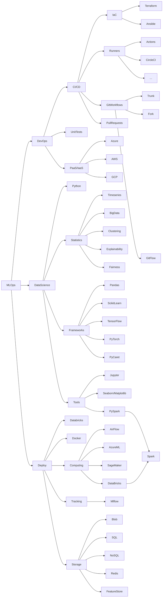

# MLOps

## Description

MLOps is the study field related to the implementation of ML applications and the scientists workflow. it is similar to DevOps, but focused on statistics and data science.

## Mindmap

## References
- [My MLOps](https://mymlops.com/)
- [MLOps.org](https://ml-ops.org/content/mlops-stack-canvas)
